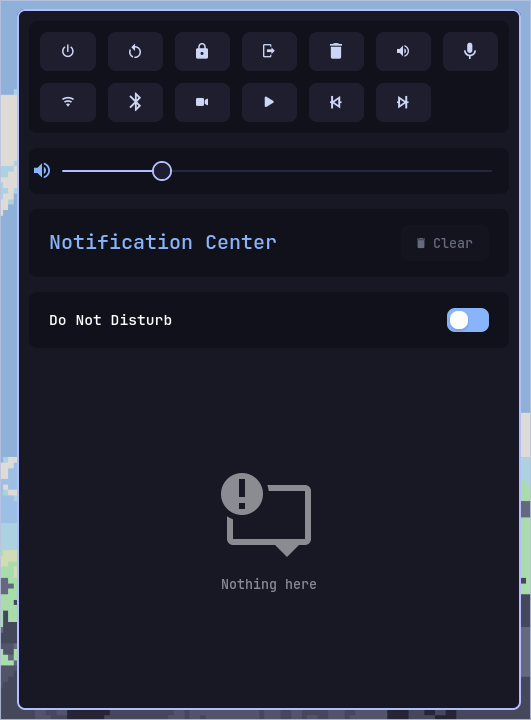

Swaync için özel bir renk teması: Mocha ve Mavi karışımı, dalga esintisiyle.
Açık kaynak ve kolay kurulabilir.
English
What is swaync-mocha-wave?

A custom color theme for swaync, blending mocha and blue hues to create a calm, wave-like aesthetic.
Installation

    Clone this repository:

git clone https://github.com/archenir/swaync-mocha-wave.git

Copy the .config folder content from the cloned repo to your swaync config directory:

    cp -r swaync-mocha-wave/.config/swaync ~/.config/

    Restart swaync or reload your configuration.

Türkçe
swaync-mocha-wave nedir?

swaync için mocha ve mavi renklerin karışımıyla oluşturulmuş, dalga esintisi hissi veren özel bir renk temasıdır.
Kurulum

    Depoyu klonlayın:

git clone https://github.com/archenir/swaync-mocha-wave.git

Klonlanan dizindeki .config klasörünü swaync konfigürasyon dizininize yapıştırın:

cp -r swaync-mocha-wave/.config/swaync ~/.config/

swaync’yi yeniden başlatın veya konfigürasyonunuzu yeniden yükleyin.
